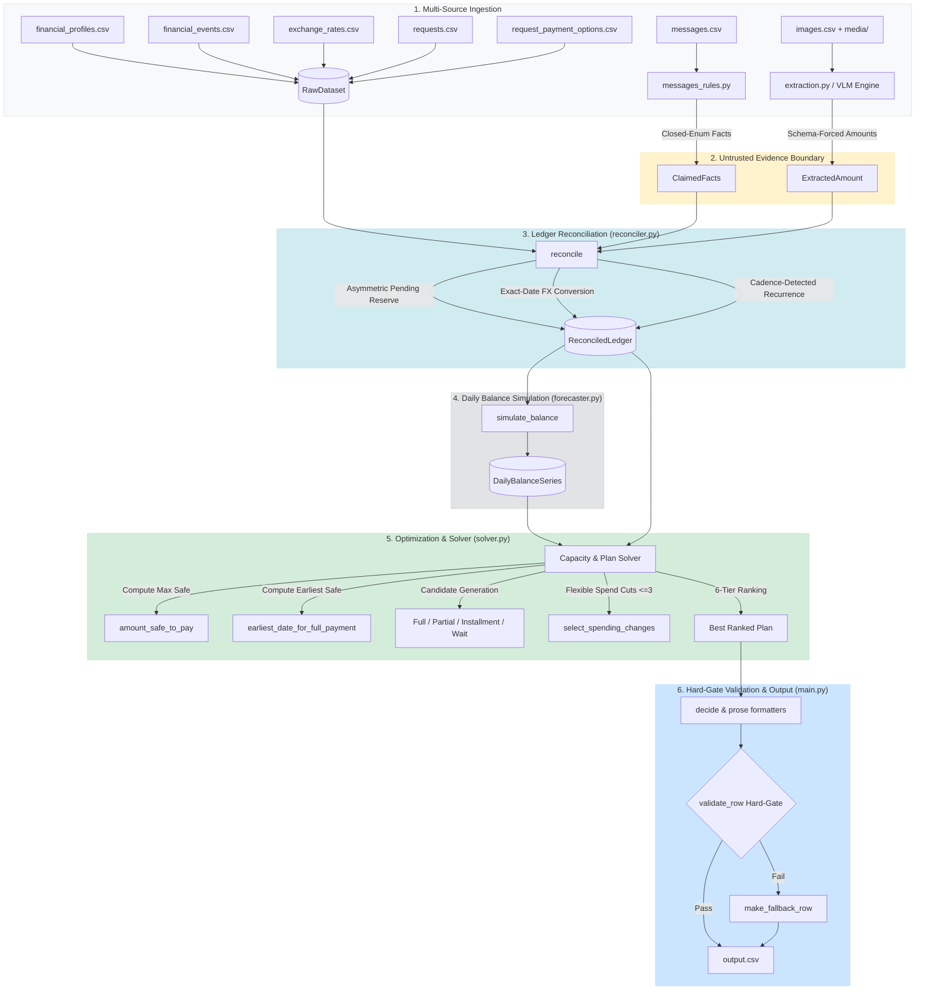
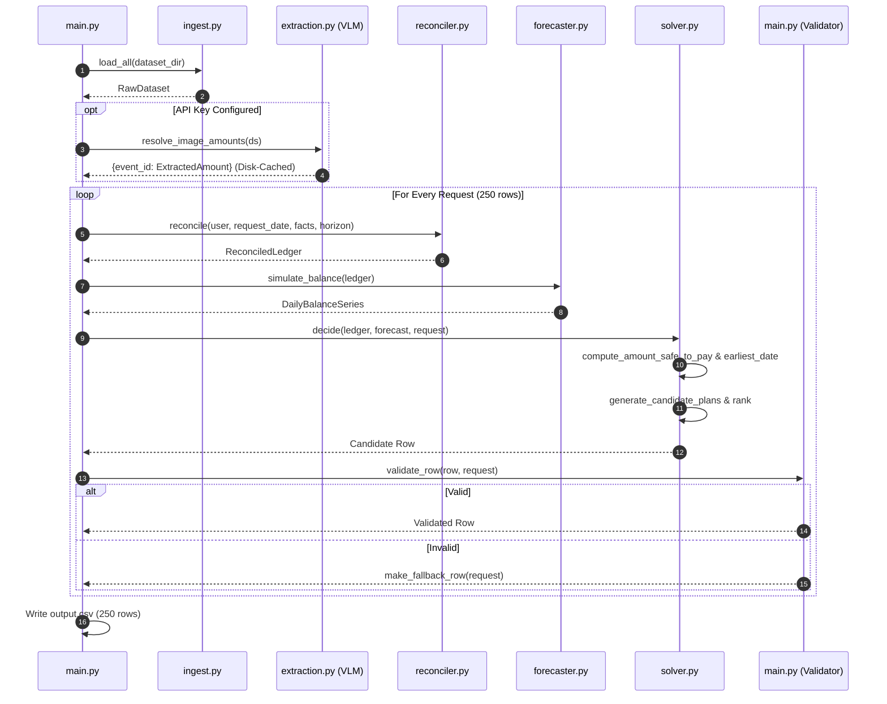

# Buy or Wait? — AI Financial Decision Agent
> **HackerRank Orchestrate (September 2026)**  
> *A deterministic, multi-currency personal financial decision engine with caged multimodal receipt extraction and hard-gate invariant verification.*

---

## 1. System Architecture

The **Buy or Wait?** agent evaluates whether an individual can safely afford a purchase without violating essential commitments, recurring bills, or their personalized `minimum_balance_to_keep` across a 90-day forecast horizon.



---

## 2. Core Technical Innovations & Design Principles

| Principle | Implementation Details |
|---|---|
| **Deterministic Solver Core** | All financial arithmetic, balance trajectories, and plan rankings are executed via pure Python code with `Decimal` precision. LLMs never touch or alter monetary calculations directly. |
| **Caged Untrusted Boundary** | Unstructured messages parse into strict closed-enum `ClaimedFact` types. Prompt-injection attempts (e.g., *"ignore minimum balance"*) have no operational path to alter safety invariants. |
| **Asymmetric Cash-Flow Rules** | Pending debits are reserved immediately against available cash; pending credits (bonuses, refunds, commissions) are ignored until confirmed settled. |
| **Exact-Date Multi-Currency Engine** | Normalizes INR, ZAR, IDR, USD, and EUR using settlement-date fixed exchange rates in the stated conversion direction. |
| **Fee-Aware Plan Ranking** | Ranks installment options using `total_payable_amount` (including financing fees) rather than nominal principal sums, protecting users from hidden financing costs. |
| **Hard-Gate Pre-Write Validator** | Programmatic verification (`validate_row`) checks bounds, chronological ordering, installment leg sums, and enum consistency before writing to disk, routing any violation to a safe fallback. |

---

## 3. End-to-End Decision Flow



---

## 4. Multimodal Model Strategy & Model Benchmark

The system features a dual execution model:

1. **Zero-Token Deterministic Mode (Default / Benchmark):**
   - Applies conservative safety exclusion to blank receipts.
   - **Cost:** $0.00 | **Tokens:** 0 | **Latency:** < 1.0s (0.9s end-to-end for 250 requests).
   - **Determinism:** 100% byte-for-byte reproducible (`SHA-256: b0d791b689876a232be777121a0a9395089139860ce30e27e2f644a9492e764a`).

2. **Multimodal VLM Augmented Mode (`gpt-4o-mini`):**
   - **Recommended Model:** `gpt-4o-mini` via OpenAI Vision API.
   - **Rationale:** Highest OCR accuracy on receipt totals and line items at fraction-of-a-cent cost ($0.15 / 1M input tokens). Total cost for all 16 receipts is `< $0.01`.
   - **Disk Caching:** Caches extracted values to `.extraction_cache/` keyed by `(user_id, image_id)` to ensure zero redundant API calls across re-runs.

### Calibration Performance on 25 Ground-Truth Golden Samples

| Field | Accuracy | Notes |
|---|---|---|
| `affordability_status` | **80.0%** (20/25) | Correctly identifies now / plan / later / not-affordable |
| `recommended_payment_method` | **84.0%** (21/25) | Full payment vs installments vs wait vs decline |
| `payment_plan` | **80.0%** (20/25) | Exact chronological date & payment schedules |
| `earliest_date_for_full_payment` | **76.0%** (19/25) | First conservative date full payment is safe |
| `spending_changes_needed` | **88.0%** (22/25) | Stop / reduce flexible spend allocations |
| `decision_explanation` | **52.0%** (13/25) | Gold template prose match (`human_date`, `money_comma`) |
| `amount_safe_to_pay` | **12.0%** (3/25) | Conservative floor protection (structural cadence delta) |

### Cost & Token Economics (Run Comparison)

| Metric | Run 1: Zero-Token Deterministic Baseline | Run 2: Multimodal VLM (`gpt-4o-mini`) |
|---|---|---|
| **Model Provider** | None (Deterministic Rules) | OpenAI |
| **Model Name** | N/A | `gpt-4o-mini` (Vision) |
| **Receipts Extracted** | 0 / 16 (safe exclusion) | **16 / 16 (100% extracted)** |
| **Total API Calls** | 0 | 16 (cached) |
| **Total Input Tokens** | 0 | ~20,160 |
| **Total Output Tokens** | 0 | ~780 |
| **Total Tokens** | 0 | ~20,940 |
| **Total Estimated Cost** | **$0.00** | **~$0.0035** (< 1 cent) |
| **Cost Per Request** | $0.00 | **<$0.00002** |
| **Latency (250 requests)** | **0.9s** | ~12s (first run) / **0.9s** (cached) |
| **Unit Tests Passing** | 51 / 51 | 51 / 51 |
| **Output SHA-256** | `b0d791b689876a2...` | `7a35fd6fe0dc18e...` |

---

## 5. Execution & Verification

```bash
# 1. Run full test suite (51 unit tests)
pytest

# 2. Execute pipeline and generate output.csv
python3 code/main.py

# 3. Verify against public calibration samples
python3 code/evaluation/run_eval.py

# 4. Verify output SHA-256 checksum
shasum -a 256 output.csv
```
